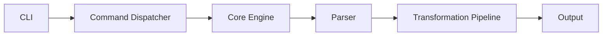
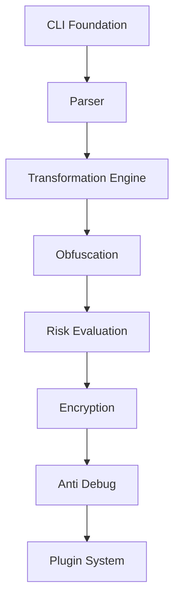
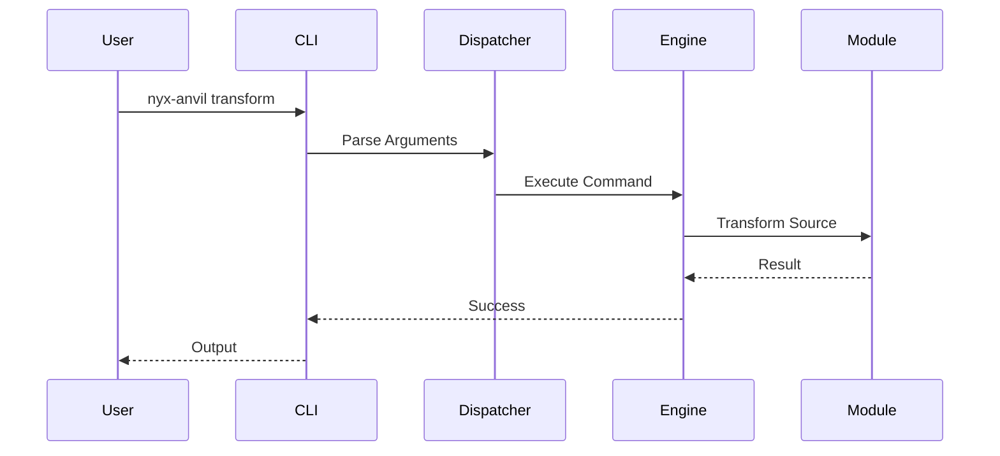

# Nyx-Anvil Blueprint

## High Level Architecture

```mermaid
flowchart LR

    CLI["CLI"]
    Dispatcher["Command Dispatcher"]
    Core["Core Engine"]

    Parser["Parser"]
    Pipeline["Transformation Pipeline"]
    Output["Output"]

    CLI --> Dispatcher
    Dispatcher --> Core

    Core --> Parser
    Parser --> Pipeline
    Pipeline --> Output
```

## Module Roadmap

```mermaid
flowchart TD

    V1["CLI Foundation"]

    V2["Parser"]

    V3["Transformation Engine"]

    V4["Obfuscation"]

    V5["Risk Evaluation"]

    V6["Encryption"]

    V7["Anti Debug"]

    V8["Plugin System"]

    V1 --> V2
    V2 --> V3
    V3 --> V4
    V4 --> V5
    V5 --> V6
    V6 --> V7
    V7 --> V8
```

## Request Flow

```mermaid
sequenceDiagram

    participant User
    participant CLI
    participant Dispatcher
    participant Engine
    participant Module

    User->>CLI: nyx-anvil transform
    CLI->>Dispatcher: Parse Arguments
    Dispatcher->>Engine: Execute Command
    Engine->>Module: Transform Source
    Module-->>Engine: Result
    Engine-->>CLI: Success
    CLI-->>User: Output
```